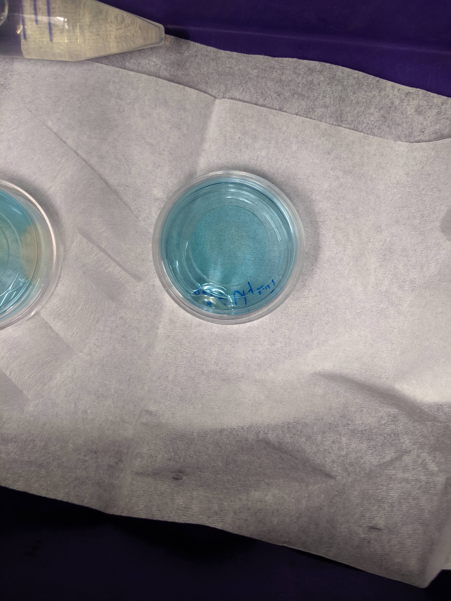

```{r setup, echo=T, message=FALSE, warning=FALSE}
library(tidyverse)
library(cowplot)
library(broom) 
library(modelr) 
library(viridis)
library(lubridate)
library(hms)
library(knitr)
library(kableExtra)

knitr::opts_chunk$set(tidy.opts=list(width.cutoff=60),tidy=TRUE, echo = TRUE, message=FALSE, warning=FALSE, fig.align="center")


source("../../IDA/tools/plotting_tools.R")

theme_set(theme_1())
```

# Intro

So you can see the last time I tried FRAP with different amounts of agarose and DNA I didn't see a quantifiable difference between the recoveries. Ideally we would be able to perform FRAP and echem on multiple samples with different diffusion constants and see how well the measurements match. Assuming that the results I got last time were not limited by a technical aspect of the FRAP acquisition, I decided to try a different way to slow down diffusion - glycerol. 

For this experiment I tried to compare a 1% agarose PBS gel to a 1% agarose gel made with (1:1 PBS glycerol *note that I used 2x PBS so that the concentrations were 1x final volume). Also, I tried this experiment on the LSM 880 scope so that I could use the two-photon excitation laser. This laser is tunable so that instead of exciting at 405 I could excite closer to the excitation max at 375nm. Note that it seems even lower excitation wavelengths may work even better according to John C's data (see [google drive](https://docs.google.com/document/d/1hm6KIiKoWGiMkYOnkCIlDg9mxvnJdElKxmkE3m2gyaY/edit)). 

One other limitation for the quantification of the 05/30 experiment was that I could not obviously tell what the effective bleach radius was (compared to nominal). It is known that just using the nominal bleach radius gives artificially low diffusion coefficient estiamtes. Therefore, I was hoping to get a stronger bleach in order to be able to clearly define this effective bleach radius. (The diffusion coefficient can then be calculated using the half recovery time)

# Methods

## Agarose pads

First, as mentioned above, I made 1% agarose pads using PBS or a 1:1 PBS (2x):Glycerol mixture. Glycerol should be very viscous and lower the diffusion coefficient. I microwaved these gels as normal and then added the 300uM PYO as described in the 5_30_19 notebook to make the gels in the coverslip bottom dishes. 

You can see that the gels look pretty similar once they were solidified. 

```{r out.width = 300}
knitr::include_graphics('Photos/IMG_20190610_113514.jpg')
```

Note that glycerol was shown to decrease the gelling temperature (meaning the gel must reach a lower temp to solidify) and this matched with what I saw - the glycerol gel took much longer to solidify >15min compared to the PBS gel. 

Then before imaging I added 90uL of the TCEP stock as described previously:

```{r out.width = 300}

```

You can see the PBS gel barely in the left side of the image, but you can clearly make out the zones of clearing from the TCEP (very similar to last time). This matched with what I saw under the microscope, where the cleared regions were highly fluorescent (reduced PYO) and blue regions were not. 

Interestingly, the TCEP seemed to work less efficiently in the glycerol gel (middle dish). You can see a faint clearing zone in the middle, that was more obvious from the top. It was unclear if this slower reaction was due to inhibition of TCEP diffusion or a difference in chemical properties of the gel. I should check now after 24 hrs if there was a change...if so perhaps I should have just waited longer. 

## Acquisition parameters
The major difference from last time is that for this FRAP acquisition I used the LSM 880 scope (not HHMI 880), which enabled adjustable two-photon excitation, and also some other advantages. Here are all pictures of the important settings:

```{r out.width = 500}


```

The notable changes are that I zoomed in even further (350um frame) which got the frame acquisition time to ~50ms! Also with the LSM 880 (not HHMI 880) frame zero and 11 acquired properly (as opposed to zero intensity). 

For all but one of the FRAPs shown here I used 250 time steps with 20x bleaching speed 4 (1 rep uses speed 3) with 128 px frame and a frame size of 350um using the 10x objective. Also note that the acquisitions here used 16bit colors, since the fluorescence with this excitation etc was weak. the 16bit gave obviously less noisy quantifications. Also note that because I used the two photon, the pinhole was much smaller (~5um) than with the 405nm laser (70um), which should affect the bleach and measured volume.

All of the czi files are on the external harddrive. The quantified mean fluor int from the bleach and reference ROIs was pasted with the file names into this [google sheet](https://docs.google.com/spreadsheets/d/1mnBrUZF4yu68k8et3r0BXi082cC4b4WgyHzSJVgPqcA/edit?usp=sharing).

# Analysis

## Overview

First let's take a look at the data. These are raw intensity values - no normalization has been done yet.
```{r}

df <- read_csv("06_10_19_PYO_FRAP_glycerol_data.csv")
  

df
```

Plotting the data looks like this:

```{r}
ggplot(df, aes(x = time, y = bleach_int, group = id, color = condition)) + geom_path(alpha = 0.5)+
  facet_wrap(~condition, scales = 'free')
```

Obviously there's a striking difference between the pattern with PBS alone vs. the PBS:Glycerol mixture. The strange thing is that the PBS glycerol pad consistently showed strong photoACTIVATION instead of photoBleaching. Very strange - see photo below immediately following 'bleaching' in the spot. On the other hand with the normal PBS pad I actually got better bleaching / acquisition with the two photon laser. You could almost clearly see the bleaching zone, which allowed me to estimate the effective bleach radius, which will be useful later. 

Also you can see that I took 4 scans with the PBS at the exact same settings, and one acquisition with a slower bleach speed. The other thing to note is that with the PBS gels we actually got a much stronger bleach (or imaged it more sensitively) than last time using the 405 laser. This bleach was about 16 percent, as opposed to ~1% last time!!

```{r out.width = '50%'}
knitr::include_graphics("Photos/IMG_20190610_174154.jpg")
```

So clearly something weird is happening here. Either only a low amount of TCEP has had time to diffuse in and the light somehow stimulates the reaction OR the TCEP diffused in but didn't react with the PYO until illuminated. You could see this effect just by live scanning the fluor int increases obviously over time.

In theory we can get a diffusion coefficient from this sort of data - see inverse or reverse FRAP. That said, I don't know how comparable it will be to the PBS normal FRAP data. Let's think about how we might avoid this in the future.

## Quantifying PBS FRAP

Ok to quantify the PBS data we need to singly normalize the data by the initial fluorescence.

```{r}
df_baselines <- df %>% group_by(condition, id) %>% 
  filter(img_num <= 10) %>% 
  summarise(avg_baseline = mean(bleach_int))

df_single_norm <- left_join(df, df_baselines, by = c('condition', 'id')) %>% 
  mutate(single_norm_int = bleach_int / avg_baseline)

ggplot(df_single_norm, aes(x = time, y = single_norm_int, group = id, color = condition)) + geom_path(alpha = 0.5)+
  facet_wrap(~condition, scales = 'free')
```

Next we will do the full scale normalization to account for the amount that was bleached. This will only make sense for the PBS dataset...so we'll drop the glycerol for now. 

```{r}
df_full_norm <- df_single_norm %>% 
  filter(condition == 'PBS') %>% 
  group_by(condition, id) %>% 
  mutate(min_single_norm_int = min(single_norm_int)) %>% 
  mutate(full_norm_int = (single_norm_int - min_single_norm_int) / (1-min_single_norm_int))

ggplot(df_full_norm, aes(x = time, y = full_norm_int, group = id, color = condition)) + geom_path(alpha = 0.5)
```

Then we need to normalize the bleach to t = 0.

```{r}
df_full_fit <- df_full_norm %>% 
  filter(time > 5) %>% 
  group_by(condition, id) %>% 
  mutate(min_time = min(time)) %>% 
  mutate(norm_time = time - min_time)
  
ggplot(df_full_fit, aes(x = norm_time, y = full_norm_int, color = condition, group = id)) + 
  geom_line(alpha = 0.5) + 
  facet_wrap(~condition, scales = 'free')

```

Finally, we can fit the recovery with our single exponential model:

```{r}
ggplot(df_full_fit, aes(x = norm_time, y = full_norm_int)) + geom_point(shape = 21) + 
    geom_smooth(method='nls',
                formula=y~(I0 - a*exp(-B * x)), 
                method.args=list(start=c(I0 = 0.85, a = 0.5, B = 0.563)),
                se=F)+
  facet_wrap(condition~id)
```

These fits actually look really good! I would say significantly better than last time. This is likely due to the faster acquisitions (50ms), and the stronger bleach. This all goes hand in hand with being able to actually see the bleached area, which further depends on how sensitively we are monitoring the bleached volume. 

And extracting the coefficients from the model gives:

```{r}
sing_exp_coef <- df_full_fit %>% 
  group_by(condition, id) %>% 
  do(tidy(nls(formula = full_norm_int~I0 - a*exp(-B * norm_time), data = ., start = list(I0 = 0.85, a = 0.5, B = 0.563) ), conf.int = T))

ggplot(sing_exp_coef, aes(x = id, y = estimate, color = condition)) + geom_pointrange(aes(ymin = conf.low, ymax = conf.high)) + 
  facet_wrap(~term, scales = 'free') + 
  scale_color_viridis_d()
```

So the outlier here was the #7 PBS acquisition, which used a bleach speed of 3 (slower) instead of 4. Other than that though, the estimates look very consistent!

Let's calculate the half recovery times $\tau_{1/2}$:

```{r}


tau_est <- sing_exp_coef %>% filter(term=='B') %>% 
  mutate(tau_mean = log(2) / estimate) %>% 
  mutate(tau_low = log(2) / conf.low) %>% 
  mutate(tau_high = log(2) / conf.high)


ggplot(tau_est, aes(x = id, y = tau_mean, color = condition)) + geom_pointrange(aes(ymin = tau_low, ymax = tau_high)) + 
  scale_color_viridis_d() + ylim(0, NA)
```

As expected from the $\beta$ parameter above, the $\tau_{1/2}$ show the expected trends, with recovery times between 2-4 seconds. Also note the longer bleached #7 takes longer to recover, which probably makes sense. 

Now let's calculate our $D_{eff}$ using just the nominal bleach radius of 50um:

```{r}
r = 0.005

d_est <- tau_est %>% 
  mutate(d_mean = (0.224*r^2) / tau_mean) %>% 
  mutate(d_low = (0.224*r^2) / tau_low) %>% 
  mutate(d_high = (0.224*r^2) / tau_high)


ggplot(d_est, aes(x = id, y = d_mean, color = condition)) + geom_pointrange(aes(ymin = d_low, ymax = d_high)) + 
  scale_color_viridis_d()
```

Ok, so with the same calculation as 05/30 we get a similar, slightly slow estimate as last time.

What if we use the modified equation though, since we can now estimate the bleach radius? I manually estimated the effective bleach diameter to be 150-200um. The larger the $r_e$ compared to $r_n$ the higher $D_{eff}$ gets corrected to. For now I used $r_e = 100um$:

```{r}
r_n = 0.005
r_e = 0.01

d_mod_est <- tau_est %>% 
  mutate(d_mean = ((r_n^2) + (r_e^2)) / (8*tau_mean)) %>% 
  mutate(d_low = ((r_n^2) + (r_e^2)) / (8*tau_low)) %>% 
  mutate(d_high = ((r_n^2) + (r_e^2)) / (8*tau_high))


ggplot(d_mod_est, aes(x = id, y = d_mean, color = condition)) + geom_pointrange(aes(ymin = d_low, ymax = d_high)) + 
  scale_color_viridis_d()
```

Correcting with $r_e$ raises the value into a reasonable range. Also note that $r_e$ must be larger for the longer bleach during id 7, so presumably if we could accurately measure that radius (this one was hard to see) it would correct into the range with the other replicates.

# Conclusions

## This experiment

1. The LSM 880 w/ 2photon gives significantly better FRAP acquisitions compared to the HHMI 880 w/ 405nm!
2. PhotoActivation occurs with PBS:glycerol agarose gels. Unclear whether this is due to slow diffusion or different chemical properties.
3. Quantifying the effective bleach radius seems to enable reasonably accurate $D_{eff}$ estimates!
4. Need to find other way to deal with glycerol or find different way to change diffusion.

## Next steps

1. Try doing two photon excitation at even lower wavelengths like 350nm, closer to the excitation max. 
2. Try with PCA? Can we use a positively charged polymer that PCA might bind to (Polyethylenimine or poly-L-lysine)?
  * https://www.ncbi.nlm.nih.gov/pmc/articles/PMC6429204/#B98-ijms-20-01252, https://www.ncbi.nlm.nih.gov/pubmed/25607687
3. Try with lower concentrations of glycerol? Allow TCEP to incubate with glycerol Gel longer.
4. Could try electrochemical reduction
5. Try bleaching a smaller spot to limit diffusion from top/bottom?

----------

