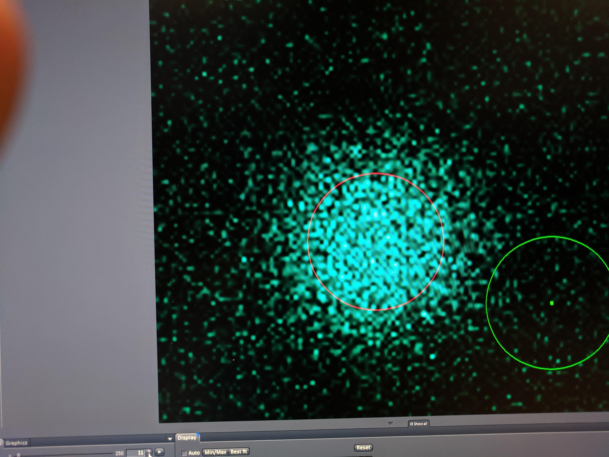

```{r setup, echo=T, message=FALSE, warning=FALSE}
library(tidyverse)
library(cowplot)
library(broom) 
library(modelr) 
library(viridis)
library(lubridate)
library(hms)
library(knitr)
library(kableExtra)

knitr::opts_chunk$set(tidy.opts=list(width.cutoff=60),tidy=TRUE, echo = TRUE, message=FALSE, warning=FALSE, fig.align="center")


source("../../IDA/tools/plotting_tools.R")

theme_set(theme_1())
```

# Intro


# Methods

I zoomed in even further (350um frame) which got the frame acquisition time to ~50ms. Also with the LSM 880 (not HHMI 880) frame zero and 11 acquired properly (as opposed to zero intensity). 

Making of the PBS:Glycerol pad - images.

# Analysis

```{r}

df <- read_csv("06_10_19_PYO_FRAP_glycerol_data.csv")
  

df
```

```{r}
ggplot(df, aes(x = time, y = bleach_int, group = id, color = condition)) + geom_path(alpha = 0.5)+
  facet_wrap(~condition, scales = 'free')
```

Obviously there's a striking difference between the pattern with PBS alone vs. the PBS:Glycerol mixture. The strange thing is that the PBS glycerol pad consistently showed strong photoACTIVATION instead of photoBleaching. Very strange - see photo below immediately following 'bleaching' in the spot. On the other hand with the normal PBS pad I actually got better bleaching / acquisition with the two photon laser. You could almost clearly see the bleaching zone, which allowed me to estimate the effective bleach radius, which will be useful later. 

Also you can see that I took 4 scans with the PBS at the exact same settings, and one acquisition with a slower bleach speed.

```{r out.width = '50%'}

```

Ok to quantify the PBS data we need to singly normalize the data by the initial fluorescence.

```{r}
df_baselines <- df %>% group_by(condition, id) %>% 
  filter(img_num <= 10) %>% 
  summarise(avg_baseline = mean(bleach_int))

df_single_norm <- left_join(df, df_baselines, by = c('condition', 'id')) %>% 
  mutate(single_norm_int = bleach_int / avg_baseline)

ggplot(df_single_norm, aes(x = time, y = single_norm_int, group = id, color = condition)) + geom_path(alpha = 0.5)+
  facet_wrap(~condition, scales = 'free')
```

Next we will do the full scale normalization to account for the amount that was bleached. This will only make sense for the PBS dataset...so we'll drop the glycerol for now. 
