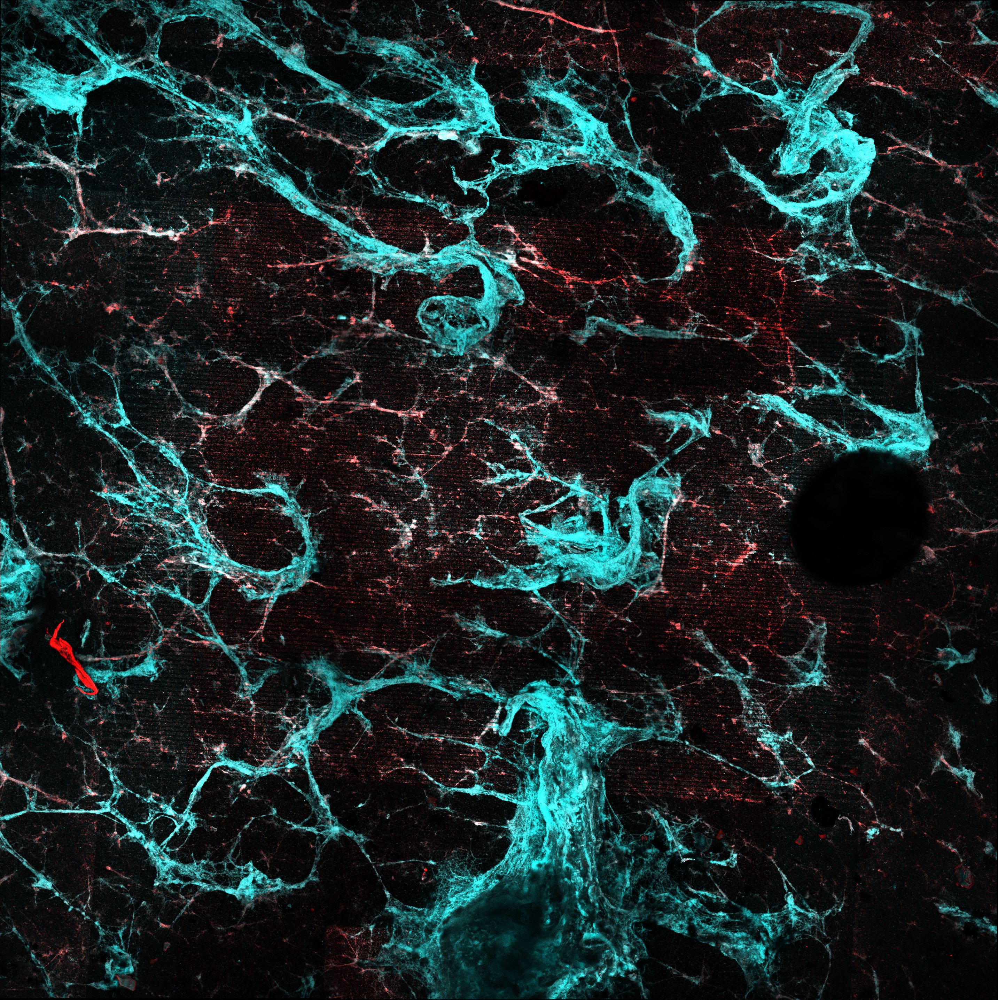
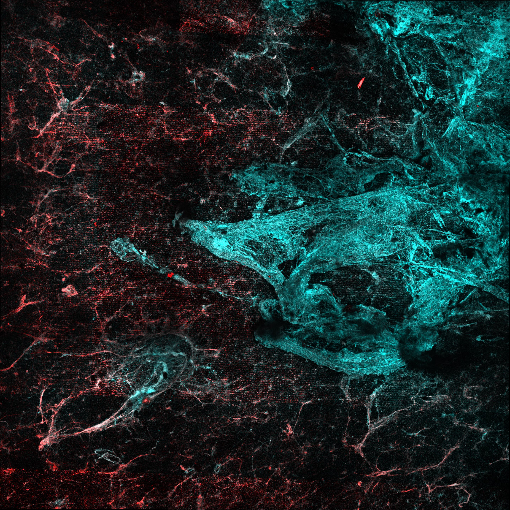

```{r setup, echo=T, message=FALSE, warning=FALSE}
library(tidyverse)
library(cowplot)
library(broom) 
library(modelr) 
library(viridis)
library(lubridate)
library(hms)
library(knitr)
library(kableExtra)

knitr::opts_chunk$set(tidy.opts=list(width.cutoff=60),tidy=TRUE, echo = TRUE, message=FALSE, warning=FALSE, fig.align="center")

source("../../tools/echem_processing_tools.R")
source("../../tools/plotting_tools.R")

theme_set(theme_1())
```

# Intro

Biofilm A {width=40%} Biofilm B {width=40%}

# Methods

In duplicate (biofilms A and B) an IDA biofilm was exposed to three different conditions sequentially:

1. Normal transfer. 75uM PYO (in PBS 50) to PBS
2. Transfer to EtBr. 75uM PYO (in PBS 50) to 10uM EtBr (in PBS)
2. Soak in EtBr and Transfer to EtBr. 75uM PYO + 10uM EtBr (in PBS 50) to 10uM EtBr (in PBS)

Note that biofilm B was dropped facedown prior to imaging. 

max intensity stitched images here

Note that biofilm B had a gassing needle clogged.


# Results


```{r}
first_reps <- read_csv("../processing/09_09_19_first_transfer_reps.csv")

soak_data <- read_csv("../processing/09_09_19_soak_data.csv")

swv_gc_max <- read_csv("../processing/09_09_19_swv_gc_max_processed.csv")
```

## Soak data

First let's take a look at how the biofilm echem looked in the soak reactors. Recall that the conditions were: 

1. PBS soak to PBS transfer
2. PBS soak to EtBr transfer
3. EtBr soak to EtBr transfer

Here are the SWVs for biofilms A and B:

```{r}
ggplot(soak_data %>% filter(echem == 'SWV' & electrode =='i1' & PHZadded == '75uM'), aes(x = E, y = current, color = factor(reactor_num), linetype = factor(rep))) + 
  geom_path() + facet_wrap(~biofilm) + scale_x_reverse()+
  labs(title = 'SWV - Soak')
```

And here are the GCs:

```{r}
ggplot(soak_data %>% filter(electrode == 'i2' & echem == 'GC' & PHZadded == '75uM'), aes(x = E, y = current, color = factor(reactor_num))) + 
  geom_path() + facet_wrap(~biofilm) + scale_x_reverse() + 
  labs(title = 'GC - Soak')
```

You can see that there's a difference in how biofilm A and B responded. A is more like what we would expect and B is confusing. My guess is that B needed more time for the PYO to get all the way into the biofilm, because it was very thick (probably limited for O2 at one point).

Let's focus on A. The SWV shows that the first run (PBS to PBS) has the highest signal, and the next run (PBS to EtBr) has a similar signal, but a little lower. I think we should interpret this as the amount of signal lost from transfer to transfer and handling the biofilm. Then you can see that the third condition (EtBr to EtBr) actually has a significantly lower signal. I think this means for biofilm A the treatements worked as intended, we can see a little bit of biofilm dependent signal in the soak and we see some of that go away when we incubate with EtBr. Similarly with the GC, we see 1 and 2 are right on top of each other and 3 is slightly lower.


## First transfer reps

So we just looked to see if we could see a change in signal with EtBr in the soak, now let's see if etbr affected the amount of PYO carried over into the transfer reactor. We're going to look at the first two SWV scans:
```{r}
first_reps <- first_reps %>% 
  mutate(condition = fct_relevel(condition, c('pbsPBS','pbsEtBr','etbrEtBr')))

ggplot(first_reps %>% filter(echem == 'swv' & electrode == 'i1'), aes(x = E, y = pred, color = condition, group = condition)) + 
  geom_path() + facet_wrap(rep~biofilm, scales = 'free') + scale_x_reverse() + 
  labs(title = 'SWV - First transfer reps')
```

and the first GC scan:

```{r}
ggplot(first_reps %>% filter(echem == 'gc' & electrode == 'i2'), aes(x = E, y = current, color = condition, group = condition)) + 
  geom_path() + facet_wrap(rep~biofilm, scales = 'free') + scale_x_reverse() + 
  labs(title = 'GC - First transfer reps')
```

In the GC we mostly see the same story as the soak data. For biofilm A, the PBS soak 1 has the highest signal, the PBS soak 2 has a significantly lower signal (now in the transfer reactor with etbr), and the etbr - etbr condition has the lowest signal. The SWV data for A does not show such dramatic differences.

The biofilm B data is similarly confusing as the soak data. It seems that the biofilm picked up more and more PYO throughout the incubations with PYO...this may be because it was a very thick biofilm. 

## Time courses
 
```{r}
swv_gc_max <- swv_gc_max %>% 
  mutate(condition = fct_relevel(condition, c('pbsPBS','pbsEtBr','etbrEtBr')))

ggplot(swv_gc_max %>% filter(electrode_from_swv == 'i1'), aes(x = norm_time_from_swv, y = max_current_from_swv, color = condition)) + geom_point() + facet_wrap(~biofilm, scales = 'free')
```

```{r}
ggplot(swv_gc_max %>% filter(electrode_from_gc == 'i2'), aes(x = norm_time_from_gc, y = max_current_from_gc, color = condition)) + 
  geom_line() + geom_point() + 
  facet_wrap(~biofilm, scales = 'free')
```

Biofilm B was very thick, probably went anaerobic when gas tube got clogged.


## SWV vs. GC

```{r}
ggplot(swv_gc_max %>% filter(electrode_from_gc == 'i2' & electrode_from_swv == 'i1'), aes(x = max_current_from_swv, y = max_current_from_gc, color = condition)) + 
  geom_point() + facet_wrap(~biofilm, scales = 'free')
```

```{r}
ggplot(swv_gc_max %>% filter(electrode_from_gc == 'i2' & electrode_from_swv == 'i1'), aes(x = max_current_from_swv, y = max_current_from_gc, color = condition)) + 
  geom_smooth(method = 'lm')+
  geom_point(shape = 21) + facet_wrap(~biofilm, scales = 'free')
```

# Next steps

-------
```{r}
sessionInfo()
```