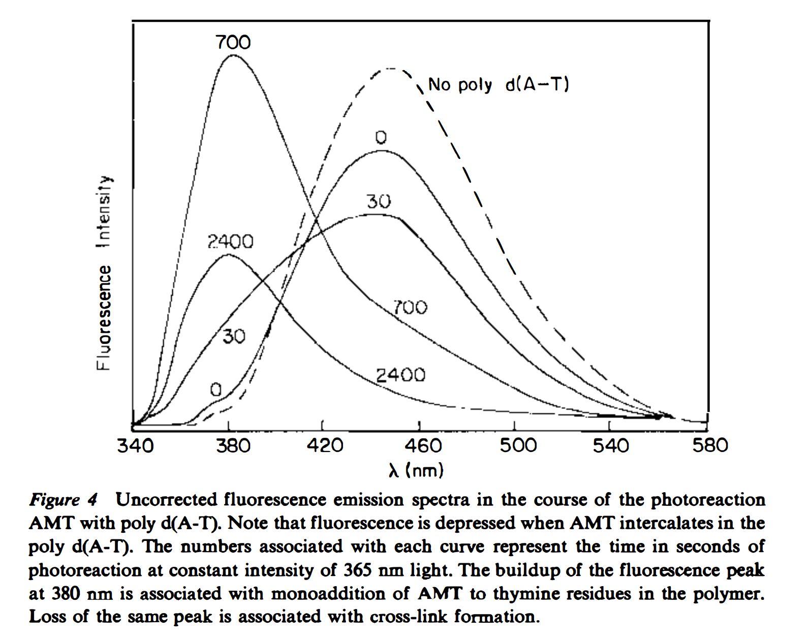

```{r setup, echo=T, message=FALSE, warning=FALSE}
library(tidyverse)
library(cowplot)
library(broom) 
library(modelr) 
library(viridis)
library(lubridate)
library(hms)

knitr::opts_chunk$set(tidy.opts=list(width.cutoff=60),tidy=TRUE, echo = TRUE, message=FALSE, warning=FALSE, fig.align="center")

source("../../tools/echem_processing_tools.R")
source("../../tools/plotting_tools.R")

theme_set(theme_1())
```

# Purpose

Recall that Jackie was excited about using a psoralen molecule as a DNA crosslinker to inhibit DNA CT in a biofilm. It turns out that there are many different psoralen derivatives that are available to purchase. Long ago I purchased 8-methoxypsoralen (8MOP), and trioxsalen (trimethylpsoralen - TMP). Upon reading some reviews like this one:
[psoralen review (Annual Review Biophysics and Bioengineering, 1981)](https://www.annualreviews.org/doi/pdf/10.1146/annurev.bb.10.060181.000441) I saw that the different derivatives may have very different binding and crosslinking kinetics with DNA. 


```{r , out.width='50%'}

```


```{r}

df <- read_csv("../Data/psoralen_crosslinking_platereader/10uM_TMP_8MOP_DNA_UVA_Timecourse.csv", skip = 13) %>% 
  gather(key = label, value = intensity, -Wavelength)

labels <- read_csv(("../Data/psoralen_crosslinking_platereader/psoralen_platereader_label_metadata.csv"))

pr_data <- left_join(df, labels, by = 'label')
```


```{r}
ggplot(pr_data, aes(x = Wavelength, y = intensity, group = factor(light_time), color = light_time)) + 
  geom_point() + geom_line() +
  facet_wrap(DNA~molecule, scale = 'free') +
  scale_color_viridis()
```

```{r}
pr_data %>% 
  filter(DNA=='plus' & molecule=='tmp') %>% 
  ggplot(., aes(x = Wavelength, y = intensity,group=factor(light_time),color=factor(light_time)))+
  geom_point()+geom_line()+
  xlim(340,540)+ylim(0,40000)+
  geom_label(x=470,y=25000,label="Free TMP",color='black') +
  geom_label(x=380,y=40000,label="Monoadduct",color='black') +
  geom_label(x=347,y=25000,label="Diadduct",color='black')+
  scale_color_viridis(discrete = T)
```