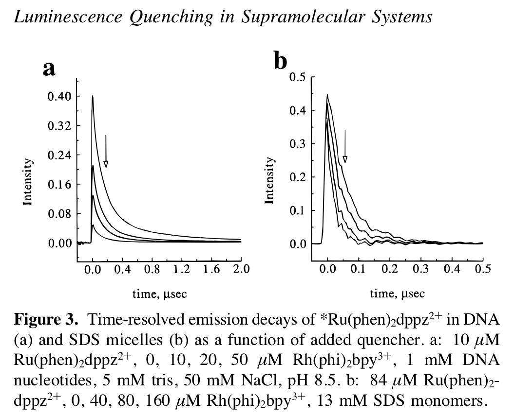
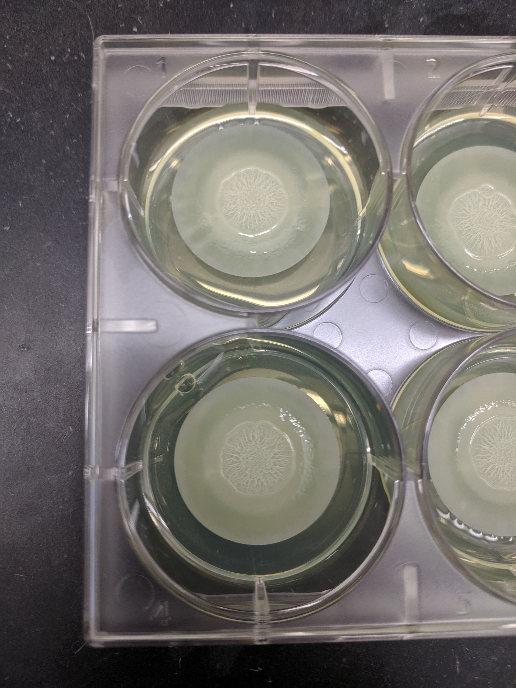
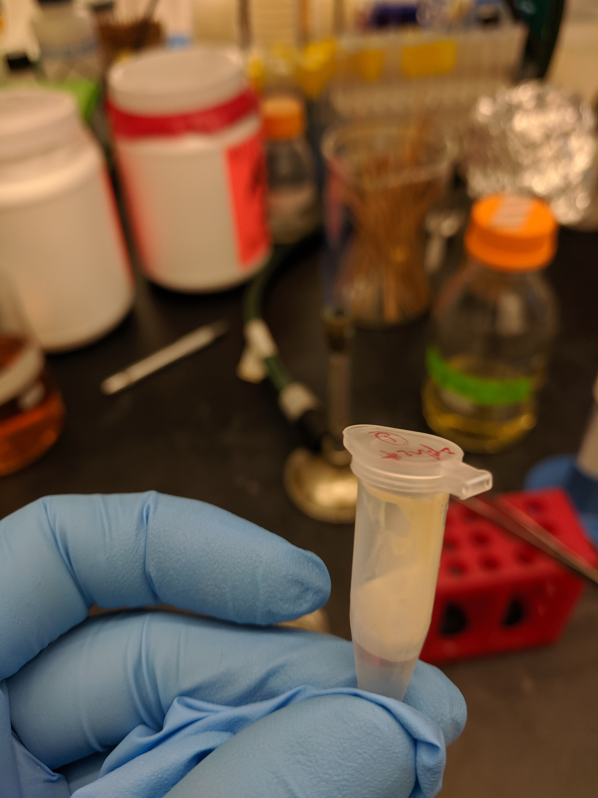
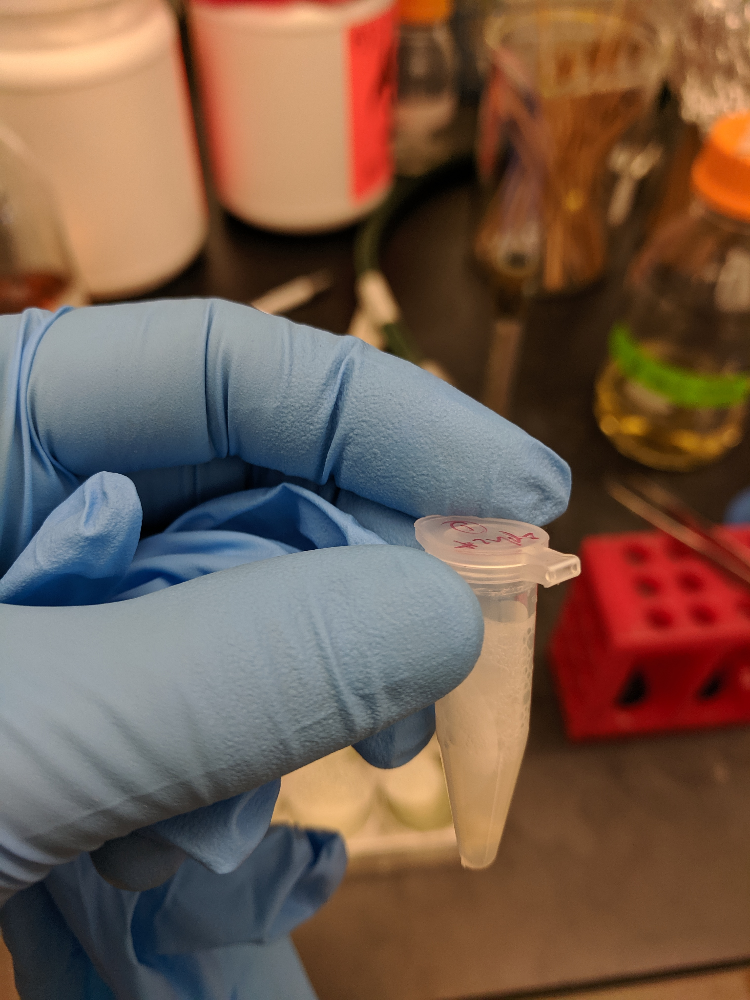
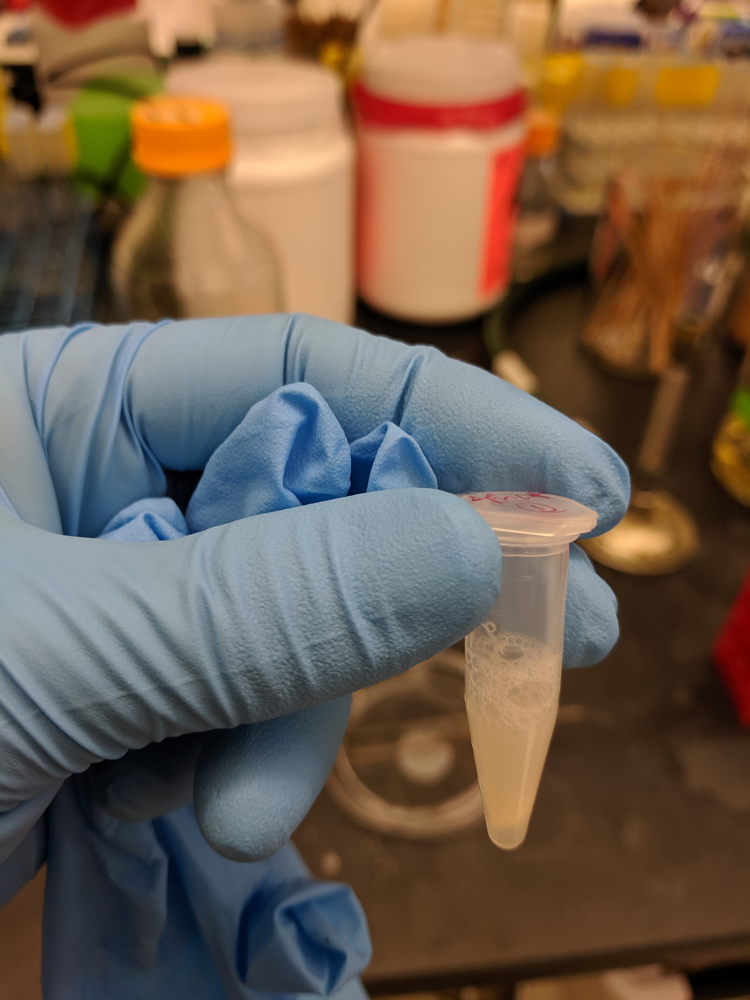
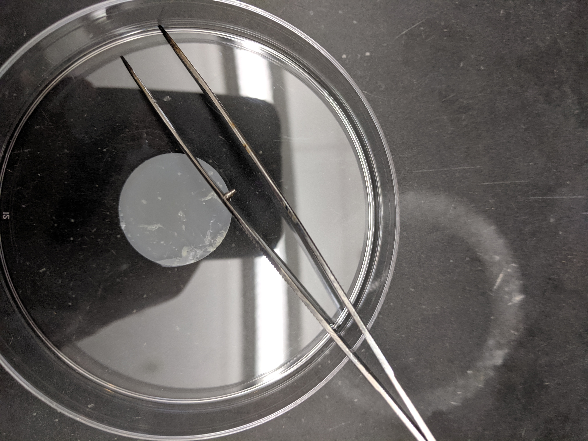
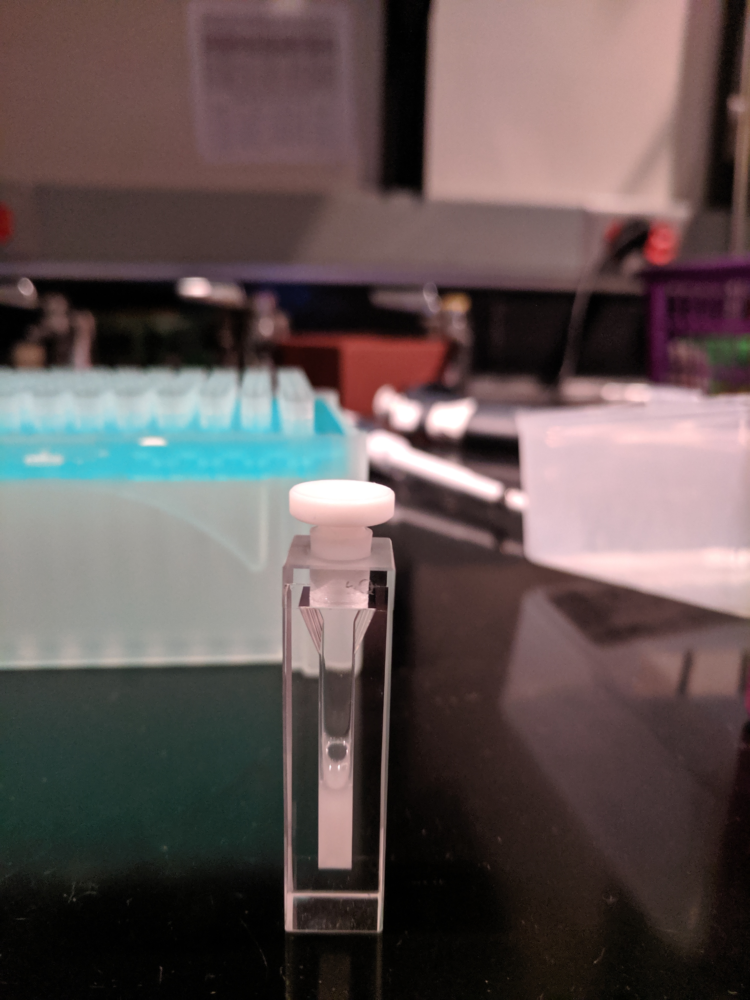

```{r setup, echo=T, message=FALSE, warning=FALSE}
library(tidyverse)
library(cowplot)
library(viridis)
library(knitr)
library(kableExtra)


knitr::opts_chunk$set(tidy.opts=list(width.cutoff=60),tidy=TRUE, echo = TRUE, message=FALSE, warning=FALSE, fig.align="center")

source("../../../IDA/tools/plotting_tools.R")

theme_set(theme_1())
```

# Intro

This set of experiments is the next iteration from this previous set [see this notebook](https://scott-saunders.github.io/labwork/Spectroscopy/08_07_19_biofilm_Ru_Rh/analysis/08_07_19_spectroscopy_biofilm_Ru_Rh.html#this-may-actually-be-static-quenching). The idea was to use time resolved spectroscopy with well-characterized metal complexes to test whether biofilm eDNA could support DNA CT. Ultimately, we were looking for evidence of DNA CT in the form of 'static quenching,' which occurs when fluorophore quenching occurs on the extremely fast time scales expected for DNA CT. See this figure below, which shows the difference between static quenching and dynamic quenching. 

```{r out.width='60%'}

```

The previous experiments suggested that we were seeing static quenching with $Ru(phen)_2dppz^{2+}$ and $Rh(phi)_2bpy^{3+}$ in resuspended colony biofilms. For this set of experiments we wanted to perform several controls to further test this result.

1. Repeat ∆phz* biofilm experiments with more concentrations of quencher.
2. Liquid grown (exponential phase) cells to determine if metal complexes were reacting with intracellular gDNA.
3. RuHex quencher to look for non DNA CT static quenching in biofilm.
4. Time dependence of $Ru(phen)_2dppz^{2+}$ signal - is it stable in the biofilm or reacting with cells.
5. In vitro experiment as positive control.

We tried all of the experiments above with the help of Eric Stemp and Nirit. Nirit did suggest one experiment that we were not able to try: determine if $Rh(phi)_2bpy^{3+}$ quencher affects biofilm background signal in the absence of $Ru(phen)_2dppz^{2+}$. 

# Methods

## Biofilms

∆phz* biofilms were grown as normal for 5 days. Plates were a little more humid than usual, but colony morphology looked relatively normal. Six replicate biofilms were grown in a 6 well plate as shown below:

{width=40%}

Colonies on membranes were placed in eppendorf tubes with 500uL of PBS 137mM NaCl, then vortexed for 1 min to resuspend. Membranes were removed and came out almost entirely clean as shown below. 

{width=20%} {width=20%} {width=20%} {width=20%}

Within 10 min of resuspension 400uL of the biofilm slurry was transferred to a cuvette:

{width=40%}

Background scans were taken with the biofilm only, which exbited a signficant signal, although the $Ru(phen)_2dppz^{2+}$ was clearly visible above this at 5uM (at 1uM it was barely visible). $Ru(phen)_2dppz^{2+}$ was excited at 532nm and emission was recorded at 620nm. Other spectroscopic information is recorded in the header of each data file, but after data file 3 (rep 3) the exact same settings were used throughout.

## Liquid Cells

A fresh LB plate of ∆phz* was streaked out the night before, and a 50mL flask of LB was inoculated on the morning of the experiment. After about 5hrs of growth the culture reached an OD of ~0.4, which was considered to be in the middle of exponential phase. In order to match the cell density of the biofilm suspension, the OD500 of the biofilm slurry was measured to be about 20. Therefore the liquid grown cells were concentrated ~50x by spinning down 24mL of culture and resuspending in 500uL of PBS 137. To the naked eye, the resuspended cells were quite opaque and of similar density.

## In vitro

A calf thymus DNA stock was diluted to 500uM nucleotides and 400uL was transferred to a cuvette. 

Generally, the $Ru(phen)_2dppz^{2+}$ and $Rh(phi)_2bpy^{3+}$ were added to the cuvettes from 200uM stocks, although for quencher eq > ~6 $Rh(phi)_2bpy^{3+}$ was added from a 1.5mM stock to avoid changing the volume dramatically. $Ru(NH_3)_6$ (aka Ruthenium hexamine aka RuHex) was added from a similarly dilute stock for the low equivalents and from a 20mM? stock for the higher equivalents.

Metal complexes were added directly the cuvette, pipetted up and down 10-15 times and then the cuvette was shaken gently to ensure complete mixing. Measurements were taken immediately following.

# Results

First let's read in all the data. We'll start with the compressed version of the data, as Jay suggested. They worked fine last time.
```{r}
# Functions modified from echem import to read in spectroscopy data

import_data <- function(filenames, file_paths, data_cols = c('time', 'intensity'), skip_rows=16) {
  
  # Adapted from echem_import() in /IDA/tools
  
  files_df <- data_frame(filename = filenames) %>% 
    mutate(file_contents = map(file_paths, ~ read_csv(.,col_names=data_cols, skip = skip_rows ))) 
  
  files_df
}

unnest_df <- function(df, filename_cols,rep=F) {
  
 # Adapted from echem_unnest_df() in /IDA/tools
  
df_unnested <- df %>% 
  unnest(file_contents)%>% 
  separate(filename, filename_cols, sep='_')

  if(rep) {
    df_unnested <- df_unnested %>% 
      mutate(rep=as.integer(str_extract(rep,"^[0-9]+"))) 
  }

df_unnested

}

import_to_df <- function(filenames, 
  file_paths, 
  data_cols = c('time', 'intensity'), 
  skip_rows=16,
  filename_cols,
  rep=F){
  
  # Combine echem_import() and echem_unnest_df() into one function.
  
  df <- import_data(filenames,  file_paths, data_cols, skip_rows)
  
  df_unnested <- unnest_df(df, filename_cols, rep)
  
  df_unnested
  
}

```

```{r}

data_path = '../data/compressed/'

data_cols <-  c('time','intensity')

skip_rows=16

# Add 'reactor' to file name so it is parsed into column
filename_cols = c('date','rep','compressed')

data_names <- dir(path=data_path, pattern = ".+[dat]$")

# Add correct paths separate from filenames
data_paths <- data_names %>% paste(data_path, ., sep='')

# Read in all SWVs with one function call 
compressed_data <- import_to_df(filenames = data_names, file_paths = data_paths, data_cols = data_cols, skip_rows = skip_rows, filename_cols = filename_cols, rep = T)

compressed_data %>% head() %>% kable(digits = 10) %>% kable_styling(bootstrap_options = 'condensed')

```

You can see that we have a file "rep" (i.e. ID number) and intensity vs. time data. There are about 63 files, so I'm going to write out the metadata in excel and merge it in so I don't have to split up the different experiments manually. Here's what the metadata look like:

```{r}

metadata <- read_csv("../data/08_29_19_spectroscopy_metadata.csv") %>% 
  group_by(material, material_id) %>% 
  mutate(run = rep - min(rep) + 1) %>% 
  mutate(exp_num = group_indices())

df <- left_join(compressed_data, metadata, by = 'rep') 

metadata %>% kable() %>% kable_styling(bootstrap_options = 'condensed') %>%
    scroll_box(width = "100%", height = "400px")

```

As described above you can see that we varied a good number of parameters. I'll generate the background subtractions and normalizations, because I know we will want to look at those. Note that background subtraction is simply subtracting the minimum value at each time point, not necessarily the biofilm only scan - we'll come back to this.

```{r}
df_bg <- df %>% 
  group_by(material, material_id, time) %>% 
  mutate(min = min(intensity)) %>% 
  mutate(bg_sub = intensity - min)

df_bg_norm <- df_bg %>% 
  filter(time>0) %>% 
  group_by(material, material_id, run) %>% 
  mutate(max = max(bg_sub)) %>% 
  mutate(norm_intensity = bg_sub / max)
```

Now, let's walk through the experiments chronologically.

## **Biofilm 1** - $Ru(phen)_2dppz^{2+}$ & $Rh(phi)_2bpy^{3+}$ 

Note that runs 1 - 3 for experiment 1 were done on a larger scale with 1uM Ru, which was not really visible. So, we moved up to 5uM Ru starting with run 4. Here's what the data looks like from here (we don't have a great biofilm only control):

```{r}

ggplot(df %>% filter(exp_num ==1 & run<=4), aes(x = time, y = intensity, color = factor(run))) + 
  geom_path() + xlim(NA, 5e-7)

ggplot(df %>% filter(exp_num ==1 & run>=4), aes(x = time, y = intensity, color = factor(quencher_eq))) + 
  geom_path() + xlim(NA, 5e-7)

```

Here you can see that the raw signal does seem to change as we added the $Rh(phi)_2bpy^{3+}$. If we background subtract from the minimum value it looks like this:

```{r}

ggplot(df_bg %>% filter(exp_num ==1 & run>=4), aes(x = time, y = bg_sub, color = factor(quencher_eq))) + 
  geom_path() + xlim(NA, 5e-7)

```

Note that this is kinda messed up, because it's just background subtract from the lowest value, which in this case is run 8...not the biofilm only control. That said, it looks like static quenching.

Let's see if the normalized curves have the same shape (and therefore lifetime):

```{r}

ggplot(df_bg_norm %>% filter(exp_num ==1 & run>=4), aes(x = time, y = norm_intensity, color = factor(quencher_eq))) + 
  geom_path() + xlim(NA, 5e-7)

```

So again, it's a little wild, because we've background subtracted with run 8, but the first few runs seems to overlay well, suggesting that they exhibit similar lifetimes.

## **Biofilm 2** - 5uM $Ru(phen)_2dppz^{2+}$ & $Rh(phi)_2bpy^{3+}$ 

This next condition was basically a better version of biofilm 1. Let's look at the raw data:

```{r}

ggplot(df %>% filter(exp_num ==2), aes(x = time, y = intensity, color = quencher_eq)) + 
  geom_path(data = df %>% filter(exp_num ==2 & ruphen_conc==0), color = 'gray', size = 3) + 
  geom_path() + xlim(NA, 5e-7)

```

Here I've highlighted the biofilm only control in gray. You can see that it is basically the same as the highest quencher concentrations. Let's see how the background subtraction looks:

```{r}

ggplot(df_bg %>% filter(exp_num ==2), aes(x = time, y = bg_sub, color = quencher_eq)) + 
  geom_path(data = df_bg %>% filter(exp_num ==2 & ruphen_conc==0), color = 'gray', size = 3) + 
  geom_path() + 
  xlim(NA, 5e-7)

```

Again, the biofilm only control is highlighted in gray. Here you can see that unfortunately the biofilm only sample is not the lowest intensity signal, meaning that the quenched signal is actually lower in certain places than the biofilm alone. I tried background subtracting from the biofilm only control, and the data looks weird, so this is where Nirit's suggestion may come in...maybe we should have background subtracted from a biofilm + $Rh(phi)_2bpy^{3+}$ control or maybe we should just be fine background subracting from the lowest value. Not sure what the best practice would be here.

That said, if we just background subtract from the lowest value, it looks like pretty good static quenching...let's see how the normalization looks:

```{r}
# Excluding the highest quencher concentration, because that was bg_sub

ggplot(df_bg_norm %>% filter(exp_num ==2 & quencher_conc < 60), 
       aes(x = time, y = norm_intensity, color = quencher_eq)) + 
  geom_path(data = df_bg_norm %>% filter(exp_num ==2 & ruphen_conc==0), color = 'gray', size = 3) + 
  geom_path() + 
  xlim(NA, 5e-7)

```

It's not perfect, but the shapes look pretty similar. The only obviously different one is the background only signal (highlighted in gray).

## **Liquid grown cells** - 5uM $Ru(phen)_2dppz^{2+}$ & $Rh(phi)_2bpy^{3+}$ 

Remember, this condition was to assess whether cells (containing genomic DNA) were sufficient to give the strong static quenching signal. If yes, that would suggest the metal complexes enter the cell and the signal could come from gDNA. If no, that suggests the signal is specific to extracellular DNA. Let's look at the raw data:

```{r}

ggplot(df %>% filter(exp_num ==7), aes(x = time, y = intensity, color = factor(run))) + 
  geom_path() + xlim(NA, 5e-7)

```

So, all the runs look almost identical. Run 1 is biofilm only, Run 2 is + $Ru(phen)_2dppz^{2+}$ , and Runs 3,4,and 5 add increasing $Rh(phi)_2bpy^{3+}$. This is already pretty clear...there's barely any signal from the $Ru(phen)_2dppz^{2+}$, which only emits when it is bound to DNA. Therefore, this data suggests that the complex is not bound to DNA when incubated with the liquid grown cells...and so the signal probably isn't coming from gDNA. Because there's basically no signal, we don't expect to see much quenching, but here's what the background subtraction looks like:

```{r}

ggplot(df_bg %>% filter(exp_num ==7), aes(x = time, y = bg_sub, color = factor(run))) + 
  geom_path() + xlim(NA, 5e-7)

```

Maybe there's a tiny $Ru(phen)_2dppz^{2+}$ signal (blue run 2) that is quenched, but it's super noisy and I don't think that really matters.


## **Biofilm 3** - 5uM $Ru(phen)_2dppz^{2+}$ & RuHex

Next we tried a different quencher, that should not be capable of fast DNA CT. In vitro this quencher should cause dynamic quenching (see intro), but Eric did express some concern that we may not see any quenching if RuHex binding were strongly inhibited by the extra NaCl in the buffer (137mM)...so we weren't sure what to expect. Here's the raw data:

```{r}

ggplot(df %>% filter(exp_num ==3), aes(x = time, y = intensity, color = quencher_eq)) + 
  geom_path() + xlim(NA, 5e-7)

```

The biofilm only background is in gray and the RuHex equivalents are shown as colors. You can see the signal does change a little bit at the higher concentrations, but it's hard to tell. Here's the background subtraction:

```{r}

ggplot(df_bg %>% filter(exp_num ==3), aes(x = time, y = bg_sub, color = quencher_eq)) + 
  geom_path() + xlim(NA, 5e-7)

```

Here the background subtraction mainly worked as intended, although you can see at short times > 0 the gray line is non zero. It looks like the signal did change upon addition of RuHex, but it's not really clear whether it's static or dynamic type quenching...and it's a little noisy. 

If we normalize it looks like this:

```{r}

ggplot(df_bg_norm %>% filter(exp_num ==3), aes(x = time, y = norm_intensity, color = quencher_eq)) + 
  geom_path() + xlim(NA, 5e-7)

```

Still very noisy...but the curves look like mostly the same shape to me. Let's try normalizing by a slightly later timepoint when the background subtraction is perfect:

```{r}
df_bg_norm_2 <- df_bg %>% 
  filter(time > 2.5e-8) %>% #Changed this number to be slightly > 0
  group_by(material, material_id, run) %>% 
  mutate(max = max(bg_sub)) %>% 
  mutate(norm_intensity = bg_sub / max)

ggplot(df_bg_norm_2 %>% filter(exp_num ==3), aes(x = time, y = norm_intensity, color = quencher_eq)) + 
  geom_path() + xlim(NA, 5e-7)

```

Now the decay looks really identical, suggesting more of a static quenching... That said, the quenching was a little noisy / weak, and probably not as clear cut as the $Rh(phi)_2bpy^{3+}$. Perhaps at lower salt concentrations we would see something different.

## **Biofilm 4** - 5uM $Ru(phen)_2dppz^{2+}$ Timecourse

This condition was to test whether the $Ru(phen)_2dppz^{2+}$ emission was changing over time. If strong changes were observed that could suggest the 'quenching' we observed was an artifact, or that the metal complex was slowly getting inside the cell or causing lysis.

Here's the data:

```{r}

ggplot(df %>% filter(exp_num ==4), aes(x = time, y = intensity, color = factor(run))) + 
  geom_path() + xlim(NA, 5e-7)

```

Looks pretty clear cut from here. Run 1 was the biofilm only and runs 2,3,4,5, and 15 were subsequent scans of the same cuvette. Run 15 was taken an additional 15 min after run 5. There seems to be no change in the signal. 

Here's the background subtraction:

```{r}

ggplot(df_bg %>% filter(exp_num ==4), aes(x = time, y = bg_sub, color = factor(run))) + 
  geom_path() + xlim(NA, 5e-7)

```

Run 15, might have a slightly higher signal than the others pointing to toxicity or cell permeability given longer times, but almost all experiments were conducted within the amount of time it took to reach run 5.

Note that without the quencher and good background subtraction from the biofilm only control, the $Ru(phen)_2dppz^{2+}$ is only about 0.015 as opposed to 0.04 for biofilms 1 and 2. To me that suggests the quenched samples in the first two really are quenching the signal to be significantly less than the biofilm only control...

Here's the normalization:

```{r}

ggplot(df_bg_norm %>% filter(exp_num ==4), aes(x = time, y = norm_intensity, color = factor(run))) + 
  geom_path() + xlim(NA, 5e-7)

```

Same shape as expected. This plot also gives us a sense of the variability in shape of the $Ru(phen)_2dppz^{2+}$ emission. Considering this, some of the earlier biofilm data with quencher looks pretty good.

## **Biofilm 5** - 10uM $Ru(phen)_2dppz^{2+}$ & $Rh(phi)_2bpy^{3+}$ 

To try to get a stronger signal, we also tried a biofilm with double the concentration of metal complexes:

```{r}

ggplot(df %>% filter(exp_num ==5), aes(x = time, y = intensity, color = quencher_eq)) + 
  geom_path(data = df %>% filter(exp_num == 5 & ruphen_conc == 0), color = 'gray', size = 3)+
  geom_path() + xlim(NA, 5e-7)

```

Here the biofilm only control is highlighted in gray. We can see a strong signal and strong quenching. Let's look at the background subtraction:

```{r}

ggplot(df_bg %>% filter(exp_num ==5), aes(x = time, y = bg_sub, color = quencher_eq)) + 
  geom_path(data = df_bg %>% filter(exp_num == 5 & ruphen_conc == 0), color = 'gray', size = 3)+
  geom_path() + xlim(NA, 5e-7)

```

As for the 5uM condition, we see what appears to be static quenching, although again the biofilm only background is not actually the lowest signal. Let's normalize:

```{r}

ggplot(df_bg_norm %>% filter(exp_num ==5 & quencher_eq<10), aes(x = time, y = norm_intensity, color = quencher_eq)) +
  geom_path(data = df_bg_norm %>% filter(exp_num == 5 & ruphen_conc == 0), color = 'gray', size = 3)+
  geom_path() + xlim(NA, 5e-7)

```

Interestingly, here we see that the curves do seem to have different shapes. Perhaps at this concentration of $Ru(phen)_2dppz^{2+}$ we are seeing a combination of static and dynamic quenching.

## **Calf thymus DNA** (500uM nucleotides) - 5uM $Ru(phen)_2dppz^{2+}$ & $Rh(phi)_2bpy^{3+}$ 

The last condition we tried was in vitro with the same concentration of metal complexes as before with calf thymus DNA. here's the data:

```{r}

ggplot(df %>% filter(exp_num ==6), aes(x = time, y = intensity, color = quencher_eq)) + 
  geom_path(data = df %>% filter(exp_num == 6 & ruphen_conc == 0), color = 'gray', size = 3)+
  geom_path() + xlim(NA, 5e-7)

```

Wow, here we see a super strong signal that is quenched very well. The biggest difference is actually that the in vitro cuvette has basically no background emission (gray). Let's look at the background subtraction:

```{r}

ggplot(df_bg %>% filter(exp_num ==6), aes(x = time, y = bg_sub, color = quencher_eq)) + 
  geom_path(data = df_bg %>% filter(exp_num == 6 & ruphen_conc == 0), color = 'gray', size = 3)+
  geom_path() + xlim(NA, 5e-7)

```

Looks like pretty strong static quenching.

This also gives us a feeling for how much of the metal complexes are bound by DNA in our biofilms. The max signal in the biofilm is about 0.04, suggesting that the eDNA concentration or solution conditions may be limiting DNA binding a little bit. 

Here's the normalized curves:

```{r}

ggplot(df_bg_norm %>% filter(exp_num ==6 & ruphen_conc >0), aes(x = time, y = norm_intensity, color = quencher_eq)) +
  geom_path() + xlim(NA, 5e-7)

```

Again, interesting. The curves are not the exact same shape, even though the background subtraction here is almost perfect. This suggests that there may be some dynamic quenching in addition to the strong static quenching.

# Conclusions

Overall, I think this set of experiments was quite helpful. As far as whether we are truly observing DNA CT based static quenching I have a few feelings:

Reassuring that:

1. static quenching essentially repeated
2. ru signal is not time dependent
3. liquid cells show basically no signal. 

Slightly concerning that:

1. biofilm only background is not minimum value in most cases
2. RuHex quenching looks kinda static
3. 10uM Ru / Rh quenching looks like combo of static and dynamic as does in vitro

Ultimately, I think the static quenching is real. I think that the whole static vs. dynamic quenching is not super clear cut and that tossing in the biofilm background signal makes it a little messier. According to the past papers, the static quenching indicates DNA CT. This result is really to be expected I think, although it is nice to know. What we are really testing here is - is eDNA intact enough to support DNA CT between these two metal complexes? We always assumed it was, because you can do PCR and restriction digest etc just like genomic DNA. Therefore, this data really suggests that the eDNA is relatively intact and not full of abasic sites and falling apart etc. 

## Next Steps

1. Background subtraction - is it ok to subtract from the most quenched sample? Should we do Nirit's experiment and test quenching of biofilm background with $Rh(phi)_2bpy^{3+}$?
2. Should we fit all of the decays to get lifetimes? What do we learn?
3. What is the best way to concisely present this data for the paper?

------

```{r}
sessionInfo()
```
