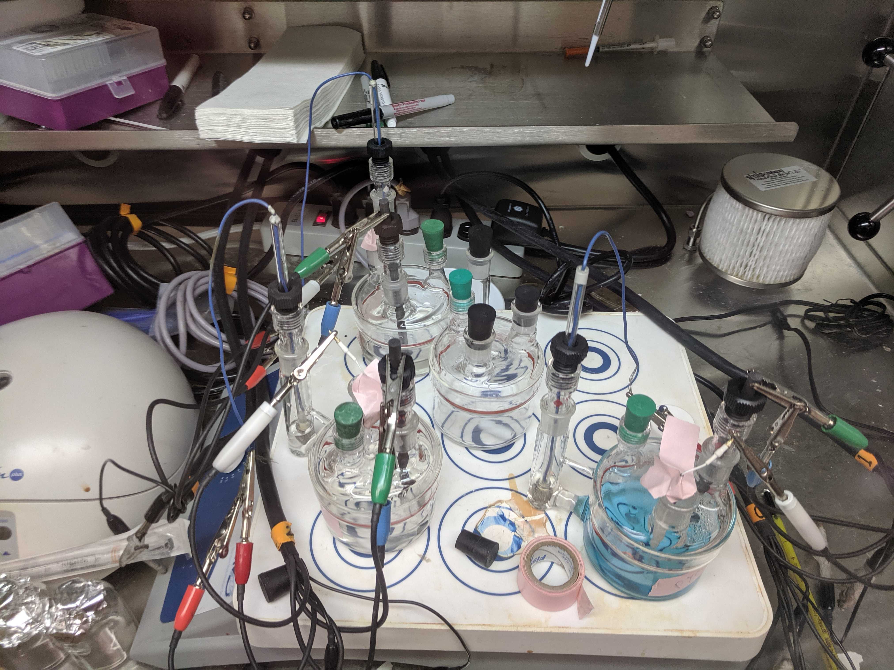
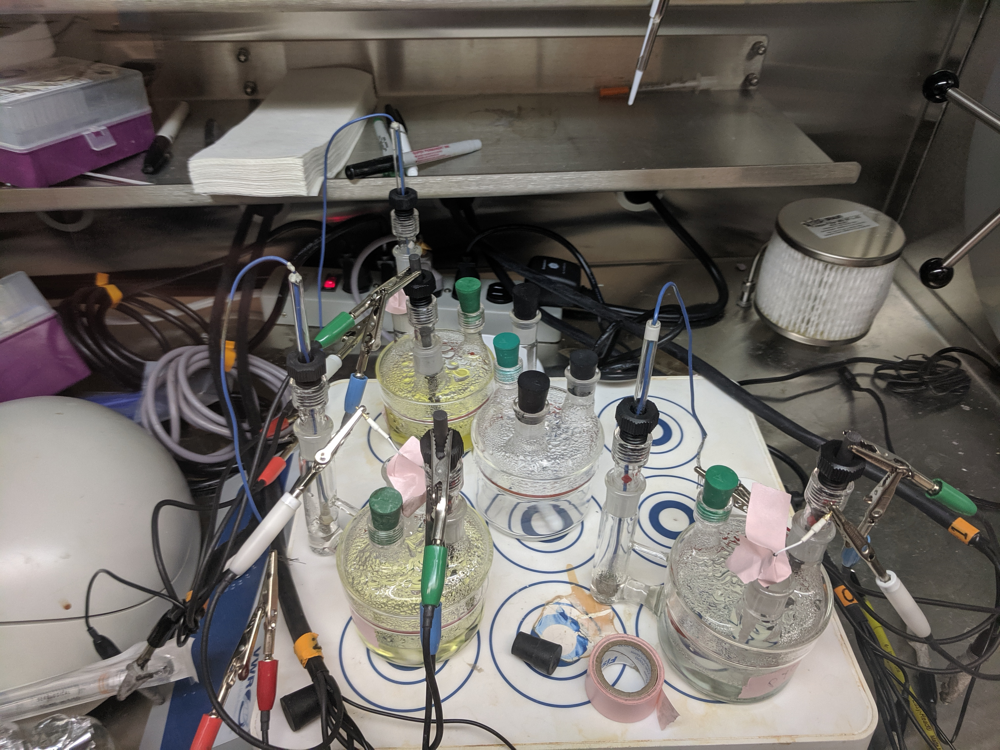
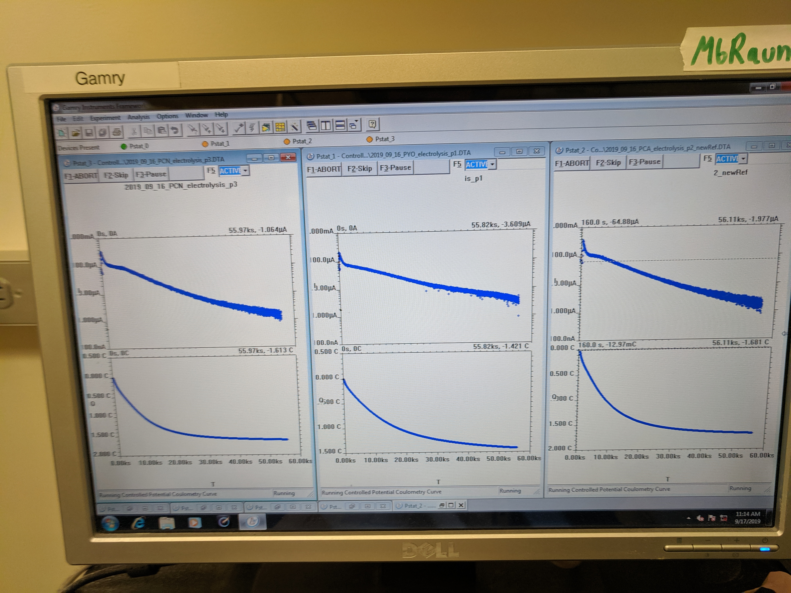
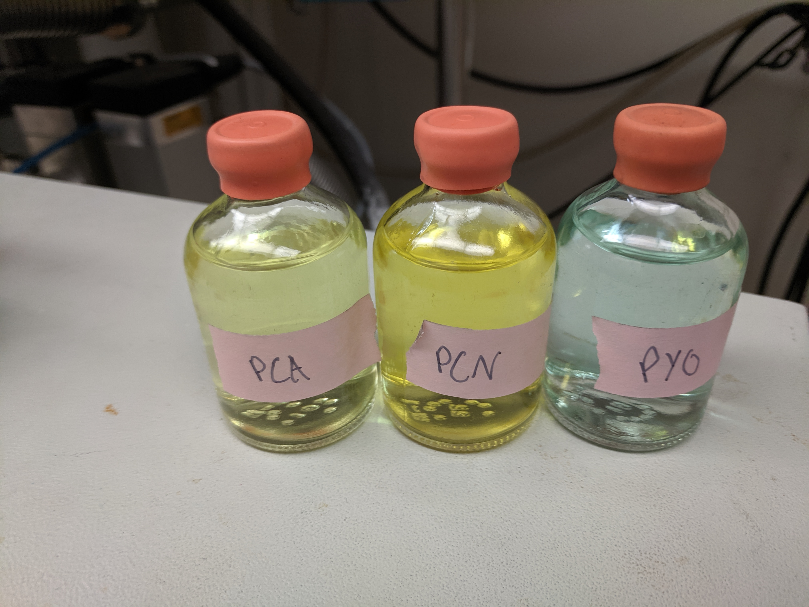

# Intro


# Methods

## Reduced phenazine prep

100uM of PCA, PYO and PCN were reduced in PBS 50 (50mL) in the survival assay chambers. Electrolysis was performed overnight and the expected color changes were observed. Reduced phenazines were transferred into stoppered serum bottles. Serum bottles were transferred to the anaerobic chamber housing the plate reader.


Pre electrolysis (left) & post electrolysis (right)

{width=30%} {width=30%}

Clockwise from the bottom right the chambers are PYO, PCA and PCN.

Electrolysis curves (left) & serum bottles (right)

{width=30%} {width=30%}

Electrolysis seemed to go to completion and the color changes remained in the serum bottles upon transfer to the other chamber.

## Plate reader measurements

Black walled, clear bottomed fluorescence 96 well plates were transferred 48 hrs in advance. Oxidized phenazines (100uM in PBS 50), and buffer (PBS 50), were transferred into the chamber 24 hours in advance and were shaken repeatedly to remove oxygen. 

Wells were measured in two fluorescence channels 360/40ex,460/40 em and 360/40ex, 528/40 em and absorbance scans were taken from 300nm - 700nm in increments of 10nm. Wells were scanned with oxidized phenazines before mixing, and then repeatedly scanned in a timecourse following mixing.

## Experimental design

Mixing 75uL of reduced phz (or buffer) with 75uL of oxidized phz (or buffer)

**1. Buffer**

  * Buffer --> Buffer
  * Buffer --> $PCA_{ox}$
  * Buffer --> $PCN_{ox}$
  * Buffer --> $PYO_{ox}$
  
**2. $PCA_{red}$**

  * $PCA_{red}$ --> Buffer
  * $PCA_{red}$ --> $PYO_{ox}$
  * $PCA_{red}$ --> $PCN_{ox}$
  
**3. $PCN_{red}$**

  * $PCN_{red}$ --> Buffer
  * $PCN_{red}$ --> $PYO_{ox}$
  * $PCN_{red}$ --> $PCA_{ox}$
  
**4. $PYO_{red}$**

  * $PYO_{red}$ --> Buffer
  * $PYO_{red}$ --> $PCA_{ox}$
  * $PYO_{red}$ --> $PCN_{ox}$
  
In this way we acquired spectra in the measured channels for all of the oxidized and reduced phenazines in isolation and in combination. Well conditions were repeated in triplicate.

# Results

# Next steps

```{r setup, echo=T, message=FALSE, warning=FALSE}
library(tidyverse)
library(cowplot)
library(viridis)
library(knitr)
library(kableExtra)


knitr::opts_chunk$set(tidy.opts=list(width.cutoff=60),tidy=TRUE, echo = TRUE, message=FALSE, warning=FALSE, fig.align="center")

source("../../IDA/tools/plotting_tools.R")

theme_set(theme_1())
```

```{r}
df_endpoints <- read_csv("data/2019_09_17_solution_ET_endpoints.csv")

df_bg_sub <- df_endpoints %>% 
  gather(key = 'wavelength',value = 'intensity',em460, em528, abs310, abs360, abs690, abs500) %>% 
  group_by(wavelength) %>% 
  mutate(min = min(intensity)) %>% 
  mutate(bg_sub = intensity - min)

ggplot(df_endpoints, aes(x = red_ox, y = em460)) + geom_point() + facet_wrap(~ox, drop = T, scales = 'free')

ggplot(df_endpoints, aes(x = red_ox, y = em528)) + geom_point() + facet_wrap(~ox, drop = T, scales = 'free')

ggplot(df_endpoints, aes(x = red_ox, y = em528)) + geom_point()

ggplot(df_bg_sub, aes(x = red_ox, y = bg_sub)) + geom_point() + facet_wrap(~wavelength, scales = 'free')
```


```{r}
predicted_values <- df_bg_sub %>% 
  filter(red == 'PBS' | ox == 'PBS') %>% 
  filter(red_ox != 'PBS_PBS')

ggplot(predicted_values %>% filter(red == 'PBS'), aes(x = red_ox, y = intensity)) + geom_point() + facet_wrap(~wavelength, scales = 'free')

ggplot(predicted_values %>% filter(ox == 'PBS'), aes(x = red_ox, y = intensity)) + geom_point() + facet_wrap(~wavelength, scales = 'free')
```

```{r}
metadata <- df_endpoints %>% select(well, red, ox, red_ox, rep)

df_spectra <- read_csv("data/2019_09_17_solution_ET_abs_spectra.csv") %>% 
  gather(key = 'well', value = 'intensity', -Wavelength)

df_spectra_meta <- left_join(df_spectra, metadata, by = c('well')) %>% 
  mutate(phz = ifelse(red == 'PYO' | ox == 'PYO', 'PYO', NA)) %>% 
  mutate(phz = ifelse(red == 'PCA' | ox == 'PCA', 'PCA', phz)) %>% 
  mutate(phz = ifelse(red == 'PCN' | ox == 'PCN', 'PCN', phz)) %>% 
  mutate(phz_redox = ifelse(red == 'PBS', 'phz_ox', 'phz_red'))

ggplot(df_spectra_meta %>% filter(red == 'PBS' | ox == 'PBS'), aes(x = Wavelength, y = intensity, color = phz_redox)) + geom_path() + facet_wrap(~phz, scales = 'free')

ggplot(df_spectra_meta %>% filter(red == 'PBS' | ox == 'PBS'), aes(x = Wavelength, y = intensity, color = phz)) + geom_path() + facet_wrap(~phz_redox)


ggplot(df_spectra_meta, aes(x = Wavelength, y = intensity, color = red)) + geom_point() + facet_wrap(~ox)

ggplot(df_spectra_meta, aes(x = Wavelength, y = intensity, color = ox)) + geom_point() + facet_wrap(~red)
```

```{r}
pred_red <- left_join(df_bg_sub %>% filter(red != 'PBS' & ox != 'PBS'), predicted_values, by = c('red','wavelength'), suffix = c('','_from_red'))

pred_red_ox <- left_join(pred_red, predicted_values, by = c('ox', 'wavelength'), suffix = c('','_from_ox')) %>% 
  mutate(pred = bg_sub_from_red + bg_sub_from_ox)

ggplot(pred_red_ox %>% filter(ox == 'PYO'), aes(x = red_ox, y = pred)) + geom_point(shape = 21, size = 3) +
  geom_point(aes(y = bg_sub),color = 'red') + facet_wrap(~wavelength, scales = 'free')

ggplot(pred_red_ox %>% filter(ox == 'PCA'), aes(x = red_ox, y = pred)) + geom_point(shape = 21, size = 3) +
  geom_point(aes(y = bg_sub),color = 'red') + facet_wrap(~wavelength, scales = 'free')

ggplot(pred_red_ox %>% filter(ox == 'PCN'), aes(x = red_ox, y = pred)) + geom_point(shape = 21, size = 3) +
  geom_point(aes(y = bg_sub),color = 'red') + facet_wrap(~wavelength, scales = 'free')
```

Maybe we can get even better bg_sub by averaging the three PBS only measurements...?

```{r}

ggplot(pred_red_ox %>% filter(ox == 'PYO'), aes(x = red_ox, y = intensity)) + geom_point() +
  geom_point(aes(y = intensity_from_red),shape = 21, size = 2, color = 'gray') +
  geom_point(aes(y = intensity_from_ox),shape = 3, size = 2, color = 'gray') +
  geom_point(aes(y = intensity_from_ox + intensity_from_red),shape = 5, size = 2, color = 'gray') +
  geom_point(aes(y = min), shape = 6, size = 2, color = 'gray')+
  facet_wrap(~wavelength, scales = 'free') + ylim(0, NA)

ggplot(pred_red_ox %>% filter(ox == 'PCA'), aes(x = red_ox, y = intensity)) + geom_point() +
  geom_point(aes(y = intensity_from_red),shape = 21, size = 2, color = 'gray') +
  geom_point(aes(y = intensity_from_ox),shape = 3, size = 2, color = 'gray') +
  geom_point(aes(y = intensity_from_ox + intensity_from_red),shape = 5, size = 2, color = 'gray') +
  facet_wrap(~wavelength, scales = 'free') + ylim(0, NA)

ggplot(pred_red_ox %>% filter(ox == 'PCN'), aes(x = red_ox, y = intensity)) + geom_point() +
  geom_point(aes(y = intensity_from_red),shape = 21, size = 2, color = 'gray') +
  geom_point(aes(y = intensity_from_ox),shape = 3, size = 2, color = 'gray') +
  geom_point(aes(y = intensity_from_ox + intensity_from_red),shape = 5, size = 2, color = 'gray') +
  facet_wrap(~wavelength, scales = 'free') + ylim(0, NA)

```

