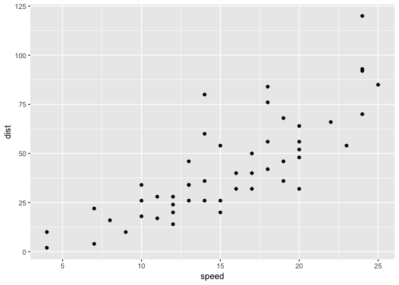

Test2 Notebook
================

From desktop!
=============

``` r
library(tidyverse)
```

    ## Warning: package 'tidyverse' was built under R version 3.4.2

    ## ── Attaching packages ────────────────────────────────── tidyverse 1.2.1 ──

    ## ✔ ggplot2 2.2.1     ✔ purrr   0.2.4
    ## ✔ tibble  1.4.2     ✔ dplyr   0.7.4
    ## ✔ tidyr   0.8.0     ✔ stringr 1.3.1
    ## ✔ readr   1.1.1     ✔ forcats 0.3.0

    ## Warning: package 'tibble' was built under R version 3.4.3

    ## Warning: package 'tidyr' was built under R version 3.4.3

    ## Warning: package 'purrr' was built under R version 3.4.2

    ## Warning: package 'dplyr' was built under R version 3.4.2

    ## Warning: package 'stringr' was built under R version 3.4.4

    ## Warning: package 'forcats' was built under R version 3.4.3

    ## ── Conflicts ───────────────────────────────────── tidyverse_conflicts() ──
    ## ✖ dplyr::filter() masks stats::filter()
    ## ✖ dplyr::lag()    masks stats::lag()

``` r
library(plotly)
```

    ## 
    ## Attaching package: 'plotly'

    ## The following object is masked from 'package:ggplot2':
    ## 
    ##     last_plot

    ## The following object is masked from 'package:stats':
    ## 
    ##     filter

    ## The following object is masked from 'package:graphics':
    ## 
    ##     layout

``` r
p <- ggplot(cars,aes(x=speed,y=dist))+geom_point()
p
```



Add a new chunk by clicking the *Insert Chunk* button on the toolbar or by pressing *Cmd+Option+I*.

When you save the notebook, an HTML file containing the code and output will be saved alongside it (click the *Preview* button or press *Cmd+Shift+K* to preview the HTML file).

latex test
----------

$$A=\\frac{B^2}{\\pi}$$

Tab test
--------

### Tab 1

a;sldkfja;lsdkfj

### Tab 2

more words
